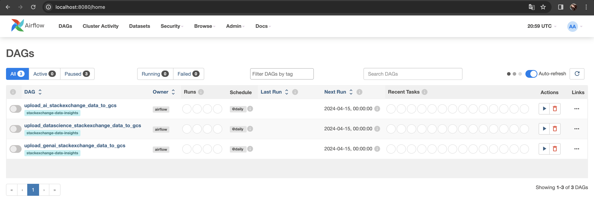
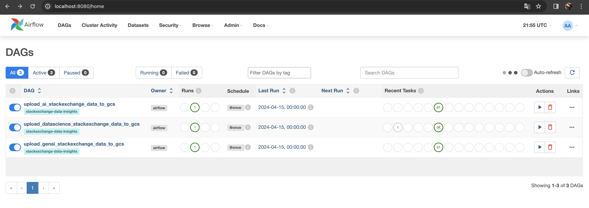
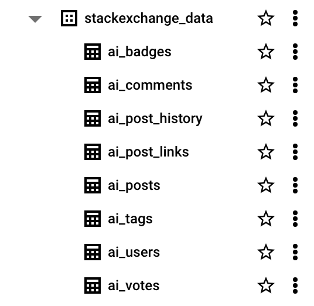
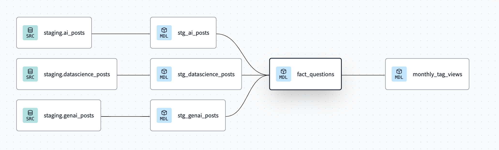
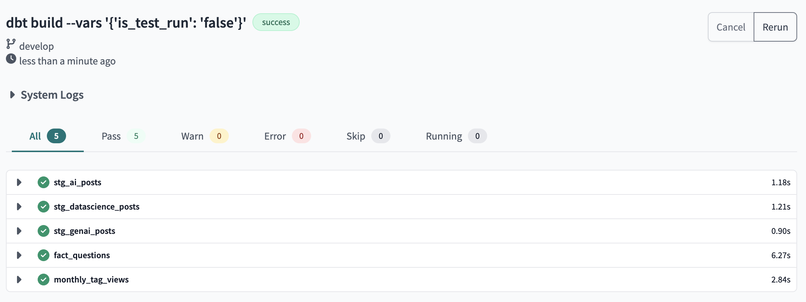
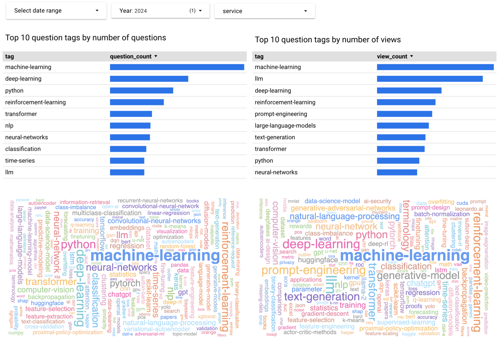
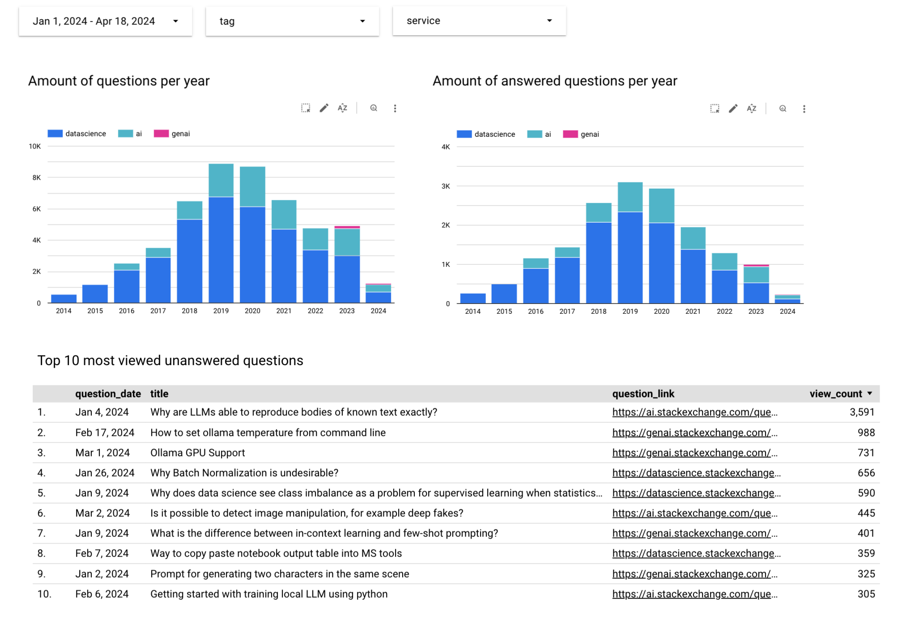

# Stack Exchange Data Insights

This project enables you to download, process, and analyze data from the [Stack Exchange](https://stackexchange.com/) network, providing valuable insights into various topics discussed on the platform.

## Table of Contents

- [Introduction](#introduction)
- [Folder Structure](#folder-structure)
- [Dataset](#dataset)
- [Technologies](#technologies)
- [Getting Started](#getting-started)
    - [Prerequisites](#prerequisites)
    - [Project Installation and Setup](#project-installation-and-setup)
- [Dashboard](#dashboard)
- [TODO](#TODO)
- [Contact](#contact)

## Introduction

The Stack Exchange Data Insights project is designed to facilitate the extraction, processing, and analysis of data from the Stack Exchange network. By leveraging various tools such as Airflow, Docker and DBT, users can seamlessly automate the data pipeline from downloading raw data to visualizing insights.

Understanding trends and patterns within Stack Exchange data can provide valuable insights into 150+ various topics, including technologies, finances, languages and many others. For me it was especially interesting to explore trends in the the fastest-emerging areas in the tech industry, such as AI and Data Science, where revolutionary technologies like Language Models (LLMs) have completely transformed our world recently. That's why in this project I analyzed questions and answers from [https://ai.stackexchange.com/](https://ai.stackexchange.com/) and [https://datascience.stackexchange.com/](https://datascience.stackexchange.com/) in order to explore trending topics and discussions in these fields and analyse how they changed over the years.

Here are some questions I explored during this project:

* What are the most populars question topics for the specific period of time?
* How the popularity of a specific question tag has changed over the time?
* Which questions have many views, but still aren't answered?

With slightly modifications this project can be utilized to analyse the data from any other Stack Exchange site(s).

## Folder Structure

```
.
├── airflow/        # Airflow DAGs and related files
├── config/         # Configuration files
├── data/           # Data files
├── dbt/            # dbt models and related files
├── docs/           # Documentation files
├── terraform       # Terraform configuration files
├── .gitignore      # Git ignore rules
├── README.md       # This file
```

## Dataset

The Stack Exchange dataset is a collection of data from various [Stack Exchange]((https://stackexchange.com/)) sites, including Stack Overflow, Mathematics, Super User, and many others. It includes questions, answers, comments, tags, and other related data from these sites.

The dataset is updated regularly and can be accessed through the [Stack Exchange Data Explorer](https://data.stackexchange.com/). For this project, I used [Stack Exchange Data Dump]((https://archive.org/details/stackexchange)), which is hosted by the Internet Archive and is updated every three months.

For this project, I used data from the following Stack Exchange sites:

* [Data Science](https://ia904700.us.archive.org/view_archive.php?archive=/6/items/stackexchange/datascience.stackexchange.com.7z)
* [Artificial Intelligence](https://ia804700.us.archive.org/view_archive.php?archive=/6/items/stackexchange/ai.stackexchange.com.7z)
* [GenAI](https://ia904700.us.archive.org/view_archive.php?archive=/6/items/stackexchange/genai.stackexchange.com.7z)

## Technologies

Here is the technology stack I used for this project:

* **Terraform**: IaC tool
* **Google Cloud Storage**: Data Lake
* **Google BigQuery**: Data Warehouse
* **Airflow**: Data Orchestration tool
* **Docker**: Containerization tool
* **dbt Cloud**: Data Transformations and Modeling
* **Looker Studio**: Data Visualisation

## Getting Started

### Prerequisites

Before you begin, ensure you have met the following requirements:

* Python 3
* Google Cloud SDK ([installation](https://cloud.google.com/sdk/docs/install-sdk))
* GCP Project ([Initial Setup](https://github.com/dianagromakovskaya/data-engineering-zoomcamp/blob/main/01-docker-terraform/1_terraform_gcp/2_gcp_overview.md#initial-setup))
* GCP Service Account with Storage Admin, BigQuery Admin and Compute Admin roles ([Setup for Access](https://github.com/dianagromakovskaya/data-engineering-zoomcamp/blob/main/01-docker-terraform/1_terraform_gcp/2_gcp_overview.md#setup-for-access))
* Docker Desktop and Docker Compose v2.14.0 or newer ([installation](https://docs.docker.com/compose/install/))
* Terraform ([installation](https://www.terraform.io/downloads))
* dbt Cloud account ([sign up](https://www.getdbt.com/signup)), connected to your GitHub account ([instructions](https://docs.getdbt.com/docs/cloud/git/connect-github))

### Project Installation and Setup

Below you can find the detailed instructions on how to set up this project.

#### 1. Clone the Repository

```bash
git clone https://github.com/dianagromakovskaya/stackexchange-data-insights.git
cd stackexchange-data-insights
```

#### 2. Configure GCP Project and Credentials

Replace GCP_PROJECT_ID in [config/config.yaml](config/config.yaml) file with your GCP project id and put your Service Account credentials to the [credentials/google_credentials.json](credentials/google_credentials.json) file. NOTE: this file path ([credentials/google_credentials.json](credentials/google_credentials.json)) is used to configure GCP connection in Terraform and Airflow, so please don't change the name and location of this file.

You can also change the bucket/dataset name to something else instead of default names via bucket and dataset fields in [config/config.yaml](config/config.yaml) file.

#### 3. Setup infrastructure with Terraform

* **Check that Terraform is installed**

```bash
terraform version
```

* **Initialize the project**

```bash
cd terraform
terraform init
```

* **Check Execution Plan**

Put your GCP project id instead of {GCP_PROJECT_ID}. If you specified your own bucket and dataset names in [config/config.yaml](config/config.yaml), remember to specify them using the `gcs_bucket` and `bq_dataset_name` variables.

```bash
terraform plan -var 'project={GCP_PROJECT_ID}'
```

After execution of this command, you should see a message like this:
```bash
Terraform will perform the following actions:

  # google_bigquery_dataset.dataset will be created
...
  # google_storage_bucket.gcs-bucket will be created
Plan: 2 to add, 0 to change, 0 to destroy.
...

```

* **Apply changes from the proposed Execution Plan to cloud**

Put your GCP project id instead of {GCP_PROJECT_ID}. If you specified your own bucket and dataset names in [config/config.yaml](config/config.yaml), remember to specify them using the `gcs_bucket` and `bq_dataset_name` variables.
```bash
terraform apply -var 'project={GCP_PROJECT_ID}'
```

After execution of this command, you should see a message like this:

```bash
Apply complete! Resources: 2 added, 0 changed, 0 destroyed.
```

* **Ensure that GCP resources have been created**

    * Navigate to [Google Cloud Storage](https://console.cloud.google.com/storage/browser]). Here you should see a new empty bucket with the name `{GCP_PROJECT_ID}_stackexchange-data` (it can be different if you've customized the bucket name in [config/config.yaml](config/config.yaml))
    * Navigate to [Google Cloud BigQuery Console](https://console.cloud.google.com/bigquery). Under your project, you should see a new empty dataset with the name `stackexchange_data` (it can be different if you've customized the dataset name in [config/config.yaml](config/config.yaml))
    
* **Destroy created objects after your work, to avoid costs on any running services**

If you want to delete the resources created in the previous steps, you can use the following command:

```bash
terraform destroy
```

#### 4. Ingest data to BigQuery with Airflow

* **Initializing Environment**

Navigate to the [airflow](airflow) directory:
```bash
cd airflow
```

After that, perform the following steps:

1. [Setting the right Airflow user](https://airflow.apache.org/docs/apache-airflow/stable/howto/docker-compose/index.html#setting-the-right-airflow-user)
2. [Initialize the database](https://airflow.apache.org/docs/apache-airflow/stable/howto/docker-compose/index.html#setting-the-right-airflow-user)


* **Running Airflow**

Now you can start all services:

```bash
docker compose up -d
```

After execution of this command, you should see a message like this:

```bash
[+] Running 9/9
 ✔ Network airflow_default                Created                                                                                                                                                                                 0.2s 
 ✔ Volume "airflow_postgres-db-volume"    Created                                                                                                                                                                                 0.0s 
 ✔ Container airflow-redis-1              Healthy                                                                                                                                                                                 0.4s 
 ✔ Container airflow-postgres-1           Healthy                                                                                                                                                                                 0.4s 
 ✔ Container airflow-airflow-init-1       Exited                                                                                                                                                                                  0.2s 
 ✔ Container airflow-airflow-scheduler-1  Started                                                                                                                                                                                 0.3s 
 ✔ Container airflow-airflow-triggerer-1  Started                                                                                                                                                                                 0.3s 
 ✔ Container airflow-airflow-worker-1     Started                                                                                                                                                                                 0.3s 
 ✔ Container airflow-airflow-webserver-1  Started 
```

* **Access the Airflow Web UI**

Open http://localhost:8080/ in your webrowser and enter login and password (Username: airflow, Password: airflow). You should see three DAGs on the home page:



Each of these DAGs is designed to download, process, and upload Stack Exchange data from the respective site to Google Cloud Storage (GCS) and BigQuery.

* **Launch the DAGs**

Toggle all switches, which are located near the DAG names, to the "On" state.

Here is a breakdown of steps, involved in each DAG (see [DAG source code](airflow/dags/dag.py)):

* **Download XML files**: The DAG starts by downloading XML files from the respective Stack Exchange website for various data categories (e.g., badges, comments, posts) using the BashOperator.

* **Convert XML to CSV**: Once downloaded, the XML files are converted to CSV format using a custom Python function (xml_to_csv), executed by the PythonOperator.

* **Upload CSV to GCS**: After conversion, the CSV files are uploaded to Google Cloud Storage (GCS) using another Python function (upload_to_gcs), executed by the PythonOperator.

* **Delete existing BigQuery tables**: Before uploading to BigQuery, any existing tables with the same names are deleted using the BigQueryDeleteTableOperator.

* **Create empty BigQuery tables**: Empty tables are created in BigQuery with the appropriate schema for each data category using the BigQueryCreateEmptyTableOperator. Table schemas are stored in the [config/table_schemas](config/table_schemas). Each table is partitioned by day to make queries more effective.

* **Load data from GCS to BigQuery**: The CSV files stored in GCS are then loaded into the corresponding BigQuery tables using the GCSToBigQueryOperator.

* **Delete local file**s: Once the data is successfully uploaded to GCS and BigQuery, the local XML and CSV files are deleted using the BashOperator.

This DAG is structured to handle each data category sequentially, ensuring dependencies are met before proceeding to the next step. Additionally, it provides cleanup steps to maintain a tidy workspace and avoid cluttering the filesystem with unnecessary files.

* **Wait fot the DAGs to finish executing**

After all the DAGs finish to run, they should look like this:



* **Verify that all the data is presented in BigQuery**

Navigate to Navigate to [Google Cloud BigQuery Console](https://console.cloud.google.com/bigquery). Under the dataset, which has been created in the third step, you should see 24 new tables named like {service}_{table}. On the screenshot below you can see the tables which have been created for the service = ai:



* **Shut down the containers and remove them**

After the data is successfully ingested to BigQuery, don't forget to stop and remove all containers:

```bash
docker compose down --volumes --remove-orphans
```

#### 5. Perform data transformations with dbt Cloud

* **Create a new dbt Cloud project**

    With a free account, you can have only one dbt Cloud project, so at first you should delete any old projects you have on the **Account Settings > Projects** page. Then you need to create a new project with the following settings:
    
    1. **Project name**: stackexchange_data_insights 
    2. **Repository**: git://github.com/{account}/stackexchange-data-insights.git

        Fork the [initial repository](https://github.com/dianagromakovskaya/stackexchange-data-insights) and add it to the list of GitHub repositories, which dbt Cloud has access to via **Personal profile > Linked accounts > Configure integration in GitHub**.

    3. **Connection**: BigQuery
        * For the warehouse, click BigQuery then Next to set up your connection. 
        * Click Upload a Service Account JSON File in settings and select the same file which you put to [config/credentials/google_credentials.json](config/credentials/google_credentials.json).
        * Click Test Connection. This verifies that dbt Cloud can access your BigQuery account.

    4. **Project subdirectory**: dbt

* **Build dbt project**

    1. Navigate to **Develop > Cloud IDE**.
    2. Open [dbt/models/staging/schema.yml](dbt/models/staging/schema.yml) file, put your GCP_PROJECT_ID to the database field and save changes. You should see the following schema on the **Lineage** tab in the bottom:
        
    3. To build the project run:
    ```bash
    dbt build --vars '{'is_test_run': 'false'}'
    ```
    

* **Ensure that all transformations have been successfully applied**

    Navigate to [Google Cloud BigQuery Console](https://console.cloud.google.com/bigquery). Under your dataset, you should see three new materialized views named `stg_ai_posts`, `stg_datascience_posts` and `stg_genai_posts` and two new tables - `fact_questions` and `monthly_tag_views`.

#### 6. Visualize data with Looker Studio


## Dashboard

[Here](https://lookerstudio.google.com/reporting/3810ed29-d5f0-412b-927e-8030b52edbaf) you can find the dashboard which I've created in Looker Studio. 

The first report shows the most popular tags over the years. You can select service in the **service** drop-down list to see the most popular tags for specific service. Also you can specify a date range or a year to see the most popular topics for the specific period of time. I also added word clouds, which illustrate popularity of different tags. For these word clouds, I used **Vega / Vega-Lite** Community Visualization.



The second report shows how the number of questions and answered questions have changed over the years. You can select service/tag in the respective drop-down list to see the same charts for a particular service or tag. I also added the table which shows top 10 most viewed questions, which haven't been answered yet. You can specify a date range to see the results for the specific period of time.


## TODO

* Use [Stack Exchange API](https://api.stackexchange.com/) instead of Stack Exchange Data Dump to get the most recent data.
* Add more DBT models and Looker Studio charts to provide more insights on the data.
* Add CI/CD.
* Add tests, logging and excpetions handlers.

## Contact

If you have any questions or suggestions, feel free to connect with me on [Linkedin](https://www.linkedin.com/in/diana-gromakovskaya-49931b188/) or DataTalks Slack (Diana Gromakovskaia).


